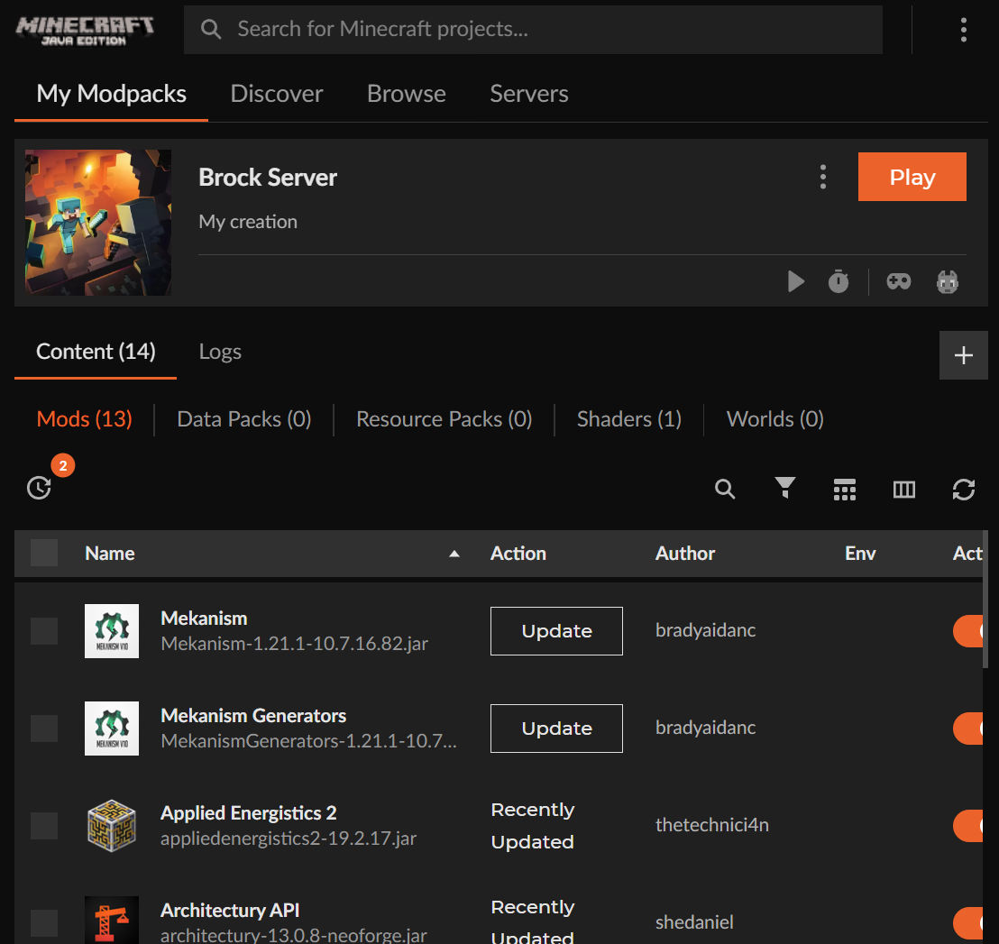

1. Install CurseForge via https://www.curseforge.com/download/app **CHOOSE STANDALONE**

2. Go through the CurseForge setup normally. Log in/Sign up with whatever email you prefer.

3. Once logged in, **install Minecraft. Choose Standard Version.**

4. Once Minecraft inside CurseForge is installed, press **create** in the top left and name it whatever you prefer, for version choose **1.21.1**, for game type choose **NeoForge**, and ModLoader version choose **neoforge-21.1.212**.

5. Once you are **inside your profile**, press the **3 dots** next to Play and select **Open Folder**. Once you have the profile folder open, **download the mods.zip in the files above**, extract the files and **put the mods into the profile folder you just opened**.

NOTE: DO NOT PRESS ANY BUTTONS EXCEPT **PLAY** INSIDE THE MODPACK TO AVOID ISSUES**
   
7. Once your profile is loaded with the mods, press play!

8. Once you are on the main menu of Minecraft, select Multiplayer and select Add Server. For name, name it whatever name you would like. **For address, please contact Brock for the address for security purposes.**

9. Once you add the server, if Brock is currently hosting it, you should be able to join! Enjoy!

HALLOWEEN SHADER STEPS

1. Start this process with Minecraft closed and CurseForge open and inside the modpack:

2. Press the three dots next to the play button and press **open folder**, this will bring up all the mods in your modpack.

3. Download the **Sodium and Iris mods above** and **drag them from your downloads folder into the modpack folder we just opened**.

4. Once they have been added to the modpack folder, press play in CurseForge again and launch into Minecraft.

5. Once you are on the main menu of Minecraft, **press Options, Video Settings, and then Shaders**. Once you are inside shaders, select **Insanity Shader** and press **apply**. Wait a couple seconds as it will be changing many visual things. Press **done**.

6. Try launching into the Server again and you should have the spooky shader on now! Enjoy!

